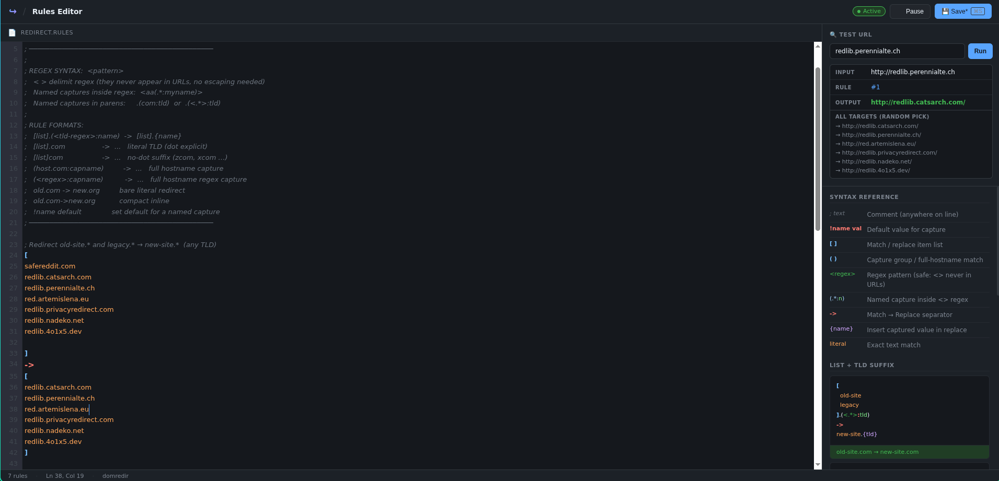

# Domain Redirector

This is a a flexible, regex-supported Domain Redirection System for redirecting websites as a chrome extensions. This project supports random destinations, named captures, and template-based URL construction.

---

## 🚀 Features

- **Flexible Matching**: Match by bare literals, lists of domains, or full-hostname regex.
- **Named Captures**: Extract parts of a domain (e.g., a username or environment) and reuse them in the redirect URL.
- **Randomized Redirection**: Provide a list of targets to distribute traffic across multiple mirrors.
- **Deep Linking**: Automatically preserves paths, queries, and fragments if the target template includes them.
- **Robust Parsing**: Bracket-aware parser that handles internal newlines and complex comments.

---

## 📝 Syntax Overview

### 1. Match Side

The left side of the arrow `->` defines what hostnames to intercept.

- **Bare Literal**: A simple string match.
  ```text
  old.example.com -> new.example.com
  ```
- **Lists**: Match any domain in a newline-separated list.
  ```text
  [
    service1.com
    service2.net
  ] -> central-hub.org
  ```
- **Regex Captures**: Use `(<regex>:name)` to capture parts of the hostname.
  ```text
  (<legacy-.*>:host) -> archive.org/{host}
  ```

### 2. The Arrow `->`

Separates the match logic from the redirection logic. It can be inline or on its own line.

### 3. Replace Side

The right side defines where the user goes.

- **Single Template**: Redirects to a specific host or full URL.
  ```text
  (user-.*:id).com -> {id}.platform.io
  ```
- **Random Selection**: Choose a random target from a list.
  ```text
  safereddit.com -> [
    redlib.catsarch.com
    redlib.perennialte.ch
  ]
  ```

---

## 🔍 Examples

### Advanced Regex Capture

Capture a subdomain and a TLD to reconstruct a URL:

```text
[
  <user-(?<id>\d+)>
  <admin-(?<id>\d+)>
].(<tld>com|org) -> {tld}.service.io/profile/{id}
```

### Default Variables

Use `!name value` to set default capture values if the regex doesn't find them.

```text
!env prod
(<.*>:sub).site.com -> {sub}.{env}.internal
```

### Comments

Use `;` to add notes. The parser ignores everything after the semicolon.

```text
; Redirect all legacy traffic
(old-site.com:url) -> new-site.com/{url} ; Includes path preservation
```

## this project was mostly created by ai

### Plans

I plan to improve the syntax highlighting and add a formatter.


